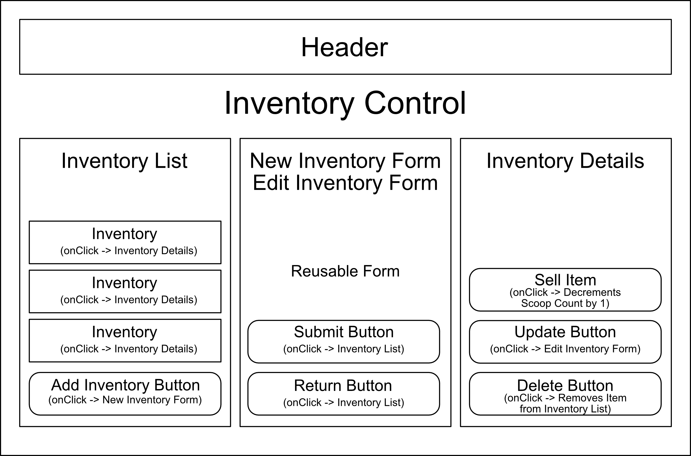

# Ice Cream Shop Inventory Tracker

## By Derrak Richard

#### A webpage built to allow users to add and keep track of inventory items. This webpage was built using JavaScript, CSS, HTML & React.

## Technologies Used

* Javascript
* Html
* CSS
* React

## Description

 This webpage was built using React and allows a user to add inventory items, along with a brief description. A user can click on an added item to see its details, along with the ability to sell a scoop (decrement the scoops remaining count by 1,) edit fields associated with the item, and delete the item.

 ## Webpage Diagram

## Setup/Installation

* Copy the git repository url
* Open a shell program & navigate to your machine's desktop
* Clone the repository using the copied URL and the "git clone" commandv* In the shell program, navigate to the root directory of the newly created file called "ice_cream_shop"
* Next, run the "npm install" command to install dependencies
* After that updates, in the root directory type "npm run start" to start the program
* If the web page does not open on it's own, open a web browser and plug "http://localhost:3000/" into the URL bar

## Known Bugs

* No known issues

## License

[MIT](LICENSE)

Copyright (c) 9/9/2022 Derrak Ruchard